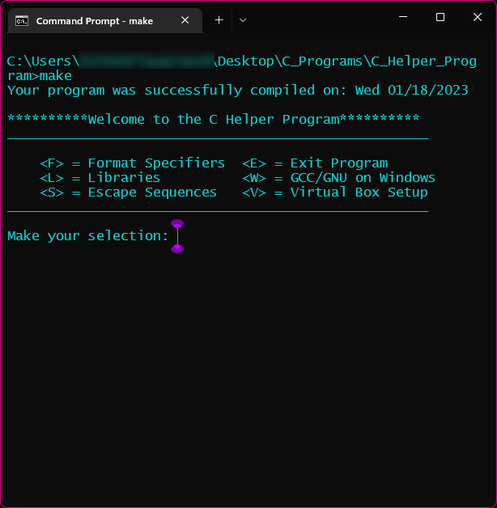

# :exclamation: The C Helper Application :exclamation:

If I haven't made it abundantly clear in my previous repo's, I love making GUI's. C is kind of gross in 
that I cannot really make a GUI the way I would prefer, unless I want to go the native Windows route. And,
I don't. Not yet. 
Also, I have a cool command line. I almost used Comic Sans. If not for making my >> look weird, it would have happened!!!!

This program is a command line C helper application.

 Did you forget the format specifiers? Oh no:open_mouth:....this can
help with that.

Did you forget what each of the standard library modules do? Oh no:open_mouth:......this can help you with that.

Has it been 5 years since you installed gcc on your pc and now the jr is asking how to do it? Oh no:open_mouth:......this can
help you with that.

Did you set up your make file in like 1995 and then use the same one forever, but then your pc finally exploded and
now you forgot how to create your make file? Oh no:open_mouth:......this can help with that.

Did Jerry with his fancy macbook tell you that you weren't a 'real' developer because you don't use Linux? Did you 
want to maybe secretly set up a virtual environment so that you could see if Linux was actually worth knowing?
Oh no:open_mouth:......this can help with that.

Did you forget all the different escape sequences because you only use the Hex one like once every decade? Oh no:open_mouth:.....
this can help with that.

## :interrobang: But Why Val? Why did you do this thing?

Because C can be fun when it isn't all gobbly gook. And, sometimes I just got to refresh my C stuff without creating an 
application that can shoot marshmallows to the moon just to test it. Sometimes I just want to take it easy. Enjoy :hearts: